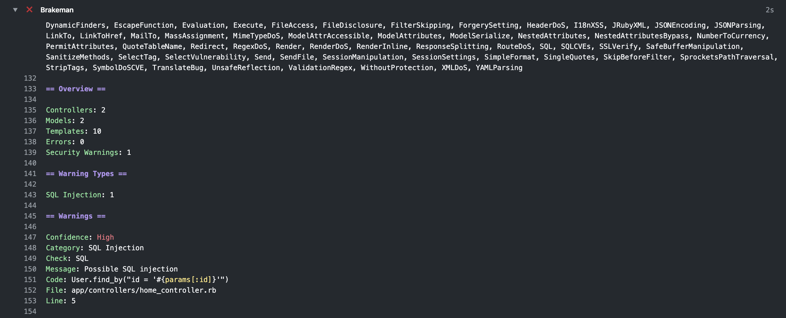

# Brakeman github action

This action run brakeman static analysis tool which checks Ruby on Rails applications for security vulnerabilities.

## Inputs

### `flags`

Brakeman options. Full list of options: <https://github.com/presidentbeef/brakeman#basic-options>

## Example usage

```yaml
uses: artplan1/brakeman-action@v1.2.1
with:
  flags: "--color"
```

## Screenshot


